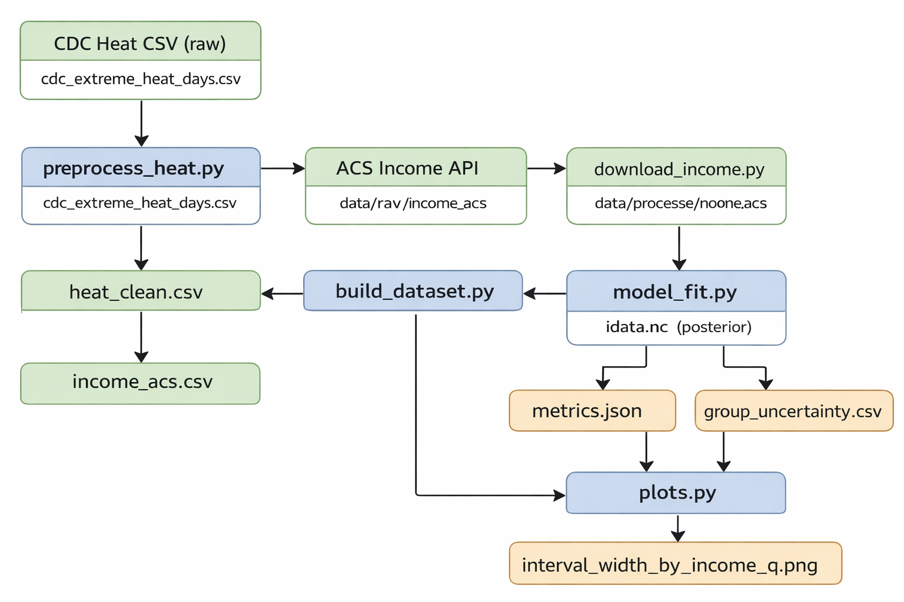

# Climate Inequality in Extreme Heat Exposure (Bayesian)

An end-to-end probabilistic pipeline that estimates **county-level extreme heat exposure** and studies whether the **time trend differs across income groups**, using **Bayesian regression** (PyMC) with uncertainty-aware evaluation and group-wise uncertainty analysis.

---

## What this project is

This project builds a reproducible workflow to:

- ingest raw county-level extreme heat data (CDC Tracking export)
- download county median household income (ACS API)
- merge + engineer features into a modeling table
- fit a **Bayesian Negative Binomial regression** to count data
- output **posterior distributions**, **credible intervals**, and **group-wise uncertainty** (income quintiles)
- generate plots that summarize predictive uncertainty by income group

---

## Why this project was created

Extreme heat is rising, but its impacts may not be uniform across socioeconomic groups. Traditional analyses often report **point estimates**, which can hide uncertainty and make group comparisons feel more certain than they really are.

This project was created to better understand:

- **How extreme heat exposure changes over time**
- Whether that trend differs **by income group** (inequality)
- How confident we should be about those conclusions using:
  - **95% credible intervals** (not just one number)
  - **probabilistic evaluation** (e.g., NLL)
  - **uncertainty comparisons** across income quintiles

---

## Data sources

### 1) Extreme heat days (county-level)
- Source: **CDC Environmental Public Health Tracking** export
- Input file (you place it here):
  - `data/raw/cdc_extreme_heat_days.csv`

Your CSV should include (or can be mapped to) columns like:
- County FIPS (e.g., `CountyFIPS`)
- Year (e.g., `Year`)
- Value = extreme heat metric (e.g., number of extreme heat days)

### 2) Income (county median household income)
- Source: **US Census ACS 5-year**
- Downloaded automatically by `src/download_income.py` into:
  - `data/processed/income_acs.csv`

---

## Method (high level)

### Modeling choice: why Negative Binomial?
The response variable is a **count** (extreme heat days). Counts often show **over-dispersion** (variance > mean), so a Negative Binomial likelihood is more realistic than a Gaussian model.

### Core idea
We model expected extreme heat days as a function of:
- income (log income)
- time (year)
- **income × year interaction** (inequality in trend)
- optional state-level variation (random effects)

Key parameter:
- **`beta_int` (income × year)**  
  - If `beta_int < 0`: the time trend is stronger for lower-income counties  
  - If `beta_int > 0`: the time trend is stronger for higher-income counties  
  - If the 95% credible interval excludes 0: stronger evidence of a directional effect

---
## Data Processing Flow

## Project structure

climate-inequality-in-Extreme-Heat-Exposure/
data/
raw/
cdc_extreme_heat_days.csv # YOU download + place here
processed/
heat_clean.csv # made by preprocess_heat.py
income_acs.csv # made by download_income.py
model_df.csv # made by build_dataset.py
model.csv # optional duplicate name
outputs/
README.md # placeholders; generated outputs usually NOT tracked
outputs/ # (if your scripts write here)
metrics.json
group_uncertainty.csv
figs/
interval_width_by_income_q.png
src/
init.py
paths.py
download_income.py
preprocess_heat.py
build_dataset.py
model_fit.py
evaluate.py
plots.py
requirements.txt
README.md

> Note: Large artifacts like `outputs/idata.nc` are intentionally not pushed to GitHub (too large). They are reproducible by rerunning the pipeline.
> Proper files structure can be found in the drive link in the about section.
---
## Steps on how you can run this:
## Installation

### Option A: Conda (recommended)
Create an environment (example name: `heatbayes`) with compatible scientific libraries:

conda create -n heatbayes -c conda-forge python=3.12 pymc arviz pandas numpy scipy matplotlib requests
conda activate heatbayes

Option B: pip (if you prefer)
pip install -r requirements.txt
How to run the full pipeline
Run these commands from the project root (the folder that contains src/ and data/):

1) Clean the heat dataset
python -m src.preprocess_heat --fips_col "CountyFIPS" --year_col "Year" --value_col "Value"
Output:
data/processed/heat_clean.csv

2) Download ACS income
python -m src.download_income --year 2022
Output:
data/processed/income_acs.csv

3) Build modeling dataset (merge + features)
python -m src.build_dataset
Output:
data/processed/model_df.csv (and optionally model.csv)

4) Fit Bayesian model (sampling)
python -m src.model_fit
Output:
outputs/idata.nc (file cannot be found in github due to being very large)

5) Evaluate reliability + group uncertainty
python -m src.evaluate
Outputs:
outputs/metrics.json
outputs/group_uncertainty.csv

6) Plot uncertainty by income group
python -m src.plots
Output:
outputs/figs/interval_width_by_income_q.png

Outputs explained
outputs/metrics.json
Contains probabilistic evaluation metrics like:

test_nll: negative log-likelihood on a holdout set (lower is better)

test_interval_coverage_proxy: a proxy coverage metric (see “Future improvements”)

outputs/group_uncertainty.csv
Summarizes uncertainty by income quintile (0=lowest income, 4=highest).

outputs/figs/interval_width_by_income_q.png
Bar chart showing average uncertainty interval width by income group.

# Notes
Large files (e.g., outputs/idata.nc) are not committed to GitHub due to size limits.

The pipeline is fully reproducible: rerun model_fit.py to regenerate inference outputs.
